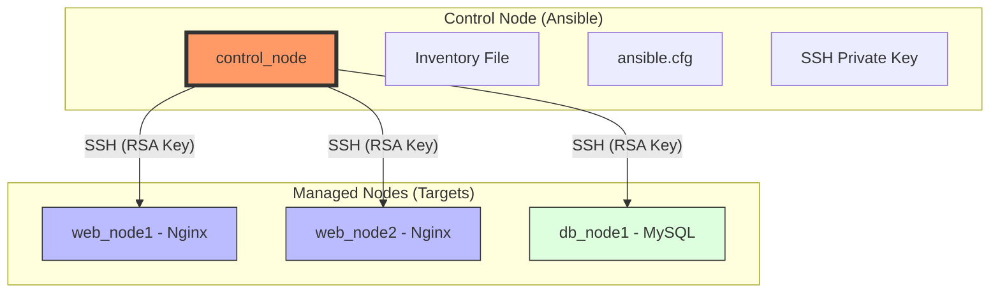

# Ansible Lab Learning Notes 

ဤ Lab သည် Ansible ကို အသုံးပြု၍ Docker container စက်များကို မည်သို့စီမံခန့်ခွဲရမည်ကို လေ့လာရန်ဖြစ်သည်။ Windows ပတ်ဝန်းကျင်တွင် တွေ့ကြုံရလေ့ရှိသော အခက်အခဲများနှင့် ၎င်းတို့ကို ဖြေရှင်းနည်းများကို ဤမှတ်စုတွင် ဖော်ပြထားသည်။

---

## 1. Architecture Overview

Ansible ၏ အလုပ်လုပ်ပုံမှာ **Agentless** ဖြစ်သည်။ ဆိုလိုသည်မှာ Managed Nodes များတွင် Software များအပိုထည့်ရန်မလိုဘဲ SSH ကိုအသုံးပြုကာ အမိန့်ပေးစေခိုင်းခြင်းဖြစ်သည်။

- **Control Node:** Ansible run သည့်စက်။ Managed nodes များဆီသို့ အမိန့်များပေးပို့သည်။
- **Managed Nodes:** စီမံခန့်ခွဲခံရမည့်စက်များ။ (ဥပမာ - Web Servers, Database Servers)
- **Inventory:** စီမံခန့်ခွဲမည့် စက်များ၏ IP address များ စာရင်း။

---

## 2. Windows Environment တွင် ကြုံတွေ့ရသော ပြဿနာများ (Windows Specific Issues)

Windows OS နှင့် Linux Docker Container များအကြား အလုပ်လုပ်ရာတွင် အဓိကအားဖြင့် **File Permission** ကွဲပြားမှုကြောင့် ပြဿနာတက်လေ့ရှိသည်။

| ပြဿနာ (Issue) | အကြောင်းရင်း (Reason) | ဖြေရှင်းနည်း (Solution) |
| :--- | :--- | :--- |
| **SSH Key Permission** | Windows မှ mount လုပ်ထားသော ဖိုင်များသည် `777` (world-writable) ဖြစ်နေသဖြင့် SSH မှ လက်မခံပါ။ | `COPY` command ကိုသုံး၍ Container အတွင်းသို့ ဖိုင်ကိုကူးထည့်ပြီး `chmod 600` ပေးရသည်။ |
| **Ignored ansible.cfg** | Directory သည် "World Writable" ဖြစ်နေပါက Ansible မှ လုံခြုံရေးအရ config ဖိုင်ကို ignore လုပ်သည်။ | `ENV ANSIBLE_CONFIG` ကို အသုံးပြု၍ config ဖိုင်လမ်းကြောင်းကို အတင်းသတ်မှတ်ပေးရသည်။ |
| **StrictModes reject** | Target စက်များရှိ `authorized_keys` သည် permission များလွန်းနေသဖြင့် SSH မှ ငြင်းပယ်သည်။ | `sshd_config` တွင် `StrictModes no` ဟု ပြောင်းလဲပေးရသည်။ |

---

## 3. (Universal Learnings)

OS နှင့်မဆိုင်ဘဲ အမြဲသတိထားရမည့် အချက်များ -

1.  **MySQL Volume Conflict:** MySQL container နှစ်ခုသည် memory ထဲရှိ data files များကို တစ်ပြိုင်တည်း မသုံးနိုင်ပါ။ (Unable to lock error)။ တစ်ခုချင်းစီအတွက် သီးသန့် Volume များ သတ်မှတ်ပေးရမည်။
2.  **Ansible Python Dependency:** Ansible သည် Target စက်များတွင် command များ run ရန် Python ရှိရန်လိုအပ်သည်။ ထို့ကြောင့် target container များတွင် `python3` ကို ကြိုတင်ထည့်သွင်းထားရမည်။
3.  **SSH Host Key Checking:** Container များကို ဖျက်ပြီးပြန်ဆောက်လျှင် SSH Fingerprint ပြောင်းလဲသွားတတ်သည်။ Lab ပတ်ဝန်းကျင်တွင် အဆင်ပြေစေရန် `host_key_checking = False` ထားခြင်းက ပိုကောင်းသည်။

---

## 4. Command များ (Common Commands)

- **Control Node အတွင်းသို့ဝင်ရန်:**
  `docker exec -it -u ubuntu control_node bash`

- **Connection စမ်းသပ်ရန် (Ping):**
  `ansible all -i inventory -m ping`

- **Playbook Run ရန်:**
  `ansible-playbook -i inventory your_playbook.yml`
